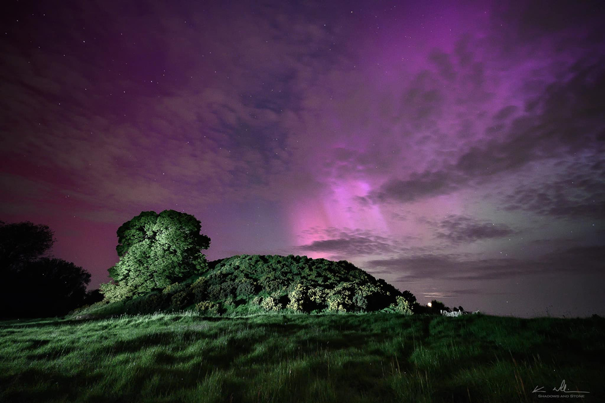

# Dowth - Seasonal and Celestial Tracker



Dowth is an elegant, minimalist web application that connects users with the rhythms of nature by visualizing the annual cycle of solstices and equinoxes alongside current moon phases. Named after the ancient Irish passage tomb that was aligned with the winter solstice, this project blends historical reverence with modern design.

## ✨ Features

- **Seasonal Timeline**: Visual representation of the four key celestial events (Winter Solstice, Spring Equinox, Summer Solstice, Autumn Equinox) with a marker showing the current position in the annual cycle
- **Moon Phase Visualization**: Dynamic display of the current moon phase with accurate calculations
- **Responsive Design**: Seamlessly adapts to any device from desktop to mobile
- **Astronomical Accuracy**: Uses precise calculations to determine both seasonal progression and lunar cycles

## 🚀 Project Structure

```
/
├── public/
│   └── dowth-background.jpg
├── src/
│   ├── components/
│   │   ├── Footer.astro
│   │   ├── MoonPhase.astro
│   │   └── Timeline.astro
│   ├── layouts/
│   │   └── Layout.astro
│   ├── styles/
│   │   └── global.css
│   └── pages/
│       └── index.astro
└── package.json
```

## 🧰 Technologies

- [Astro](https://astro.build/) - Fast, modern static site generator
- [Tailwind CSS](https://tailwindcss.com/) - Utility-first CSS framework
- Vanilla JavaScript for astronomical calculations
- Custom SVG/CSS for celestial visualizations

## 📅 Astronomical Calculations

The project includes accurate calculations for:

- **Seasonal Progression**: Tracks the Earth's journey through the solar year
- **Moon Phases**: Uses Julian date calculations to precisely determine the current lunar phase
- **Days Until Next Event**: Calculates the days remaining until the next solstice or equinox

## 🌗 Moon Phase Algorithm

The moon phase visualization uses a Julian date algorithm to calculate the current phase with high precision:

1. Converts current date to Julian date format
2. Calculates days since a known new moon (Jan 6, 2000)
3. Uses the accurate lunar cycle period (29.53058867 days)
4. Creates a visual representation using CSS gradients

## 🖥️ Development

### Prerequisites

- Node.js (v16 or newer)
- npm or yarn

### Getting Started

1. Clone the repository:
   ```
   git clone https://github.com/BernardMcWeeney/dowth.git
   cd dowth
   ```

2. Install dependencies:
   ```
   npm install
   ```

3. Start the development server:
   ```
   npm run dev
   ```

4. Open your browser to `http://localhost:4321`

### Building for Production

```
npm run build
```

The production-ready site will be generated in the `dist/` directory.

## 📱 Responsive Design

The application is designed to work beautifully on all screen sizes:

- **Desktop**: Full timeline with detailed seasonal markers
- **Mobile**: Simplified timeline with current season prominently displayed

## 🌠 Credits

- Designed and developed by Bernard McWeeney
- Inspired by the ancient Dowth passage tomb in Ireland's Boyne Valley
- Astronomical calculations adapted from established algorithms

## 📜 License

This project is open source and available under the [MIT License](LICENSE).

---

*Note: The name "Dowth" comes from the Irish "Dubhadh" meaning "darkening", reflecting the site's connection to the winter solstice.*